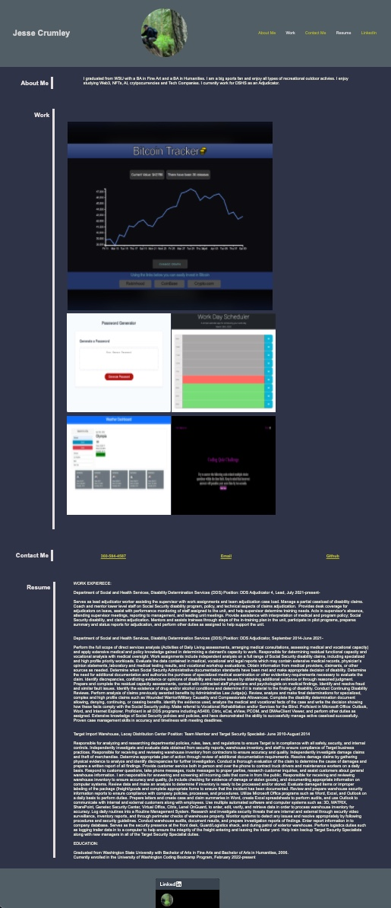

# 02 Advanced CSS: Portfolio

This weeks homework assignment is to create a professional portfolio to showcase my my skills and talents to employers. 

## User Story

Make a portfolio of work samples for potential employers to view. 

## Acceptance Criteria

1. Samples of previous work
2. developer's name, a recent photo or avatar, and links to sections about them, their work, and how to contact them
3. Be able to click a link in the navigation and the UI scrolls to the corresponding section.
4. click on the link to the section about their work.
then the UI scrolls to a section with titled images of the developer's applications.
5. The first application image should be larger in size than the others.
6. Click on images of the applications and are then taken to that deployed application. 
7. Resize the page or view the site on various screen devices.
8. Presented with a responsive layout that adapts to my viewport. 

<a href=https://crumwj22.github.io/professional-portfolio>Professional Portfolio</a>

