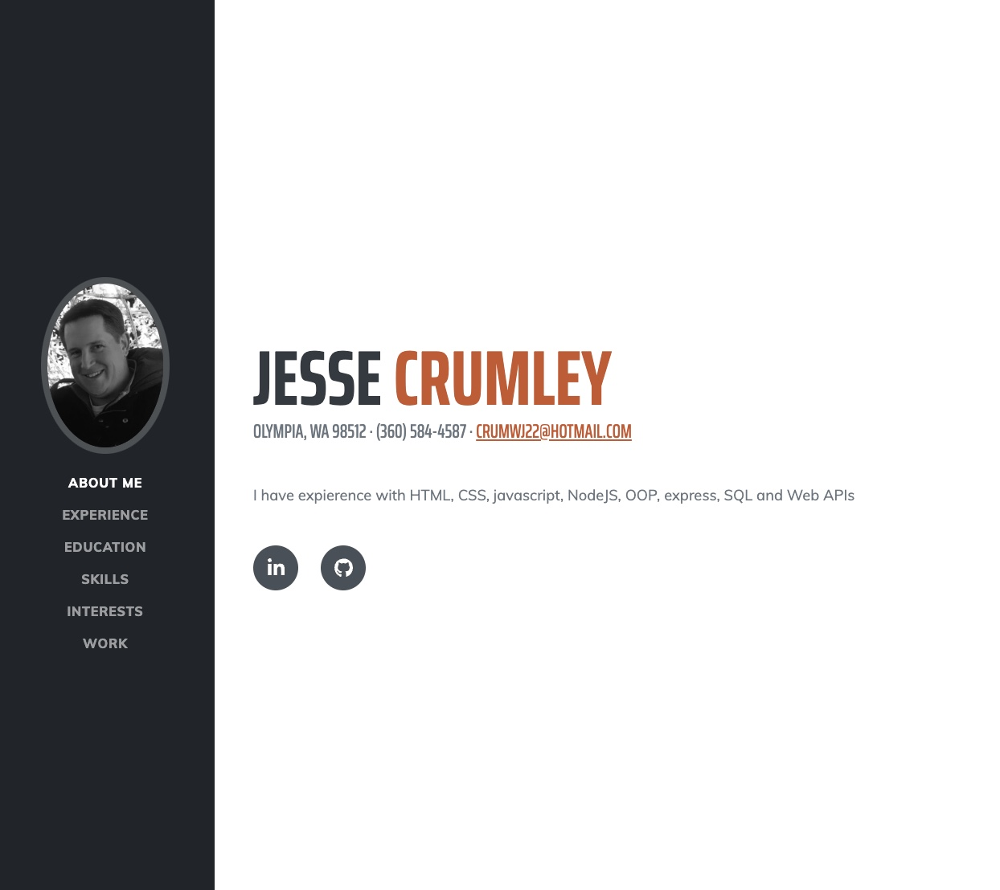

# Professional Portfolio

This is a professional portfolio to showcase my my skills and talents to employers.

## Description

Having a professional portfolio enhances who you are as a candidate, helps you stand out from other applicants, and puts you at the head of the line to get the job. It is a much better way to market your strengths and abilities by providing a creative way in presenting them.

<a href=https://crumwj22.github.io/professional-portfolio target="_blank">Professional Portfolio</a>

